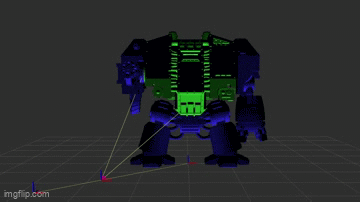
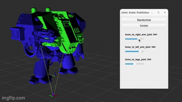

# dreadnought_urdf: A ros2 model

## Overview

A basic urdf for a dreadnought model. There are three movable joints: left arm, right arm and the torso. Unfortunately the mesh file does not have any movable parts so there is no walking functionaltiy.

This is a first attempt at making a robot model for use in rviz/gazebo.

If you would like to try making one yourself, take a look at:
* ["Building a Visual Robot Model with URDF from Scratch"](http://wiki.ros.org/urdf/Tutorials/Building%20a%20Visual%20Robot%20Model%20with%20URDF%20from%20Scratch)
* [How do we describe a robot? With URDF! | Getting Ready to build Robots with ROS #7](https://www.youtube.com/watch?v=CwdbsvcpOHM&ab_channel=ArticulatedRobotics)

## Getting started

This assumes you have a working ros2 humble installation.

Clone the project into your ros2 workspace and run the following:

    source /opt/ros/humble/setup.bash
    colcon build 
    source install/setup.bash 
    ros2 launch dreadnought_urdf display.launch.py

There is also an [update script](urdf_updater/updater.py) which allows for update of link coordinates without having to open/close rviz2. See the file header for details on it's usage.

## Credits

[Model mesh](https://cults3d.com/en/3d-model/art/dreadnought-base-model-with-extra-arms) by Geddraz

Based on the [urdf_tutorial](https://github.com/ros/urdf_tutorial/) project

## Contributing

Any and all improvements are most welcome, particularly amends that will allow for additional movement (legs, arms).